## 计算机毕业设计之Python+Spark+LSTM电商爬虫 商品推荐系统 商品评论情感分析 电商大数据 电商推荐系统 大数据毕业设计

## 要求
### 源码有偿！一套(论文 PPT 源码+sql脚本)

https://www.bilibili.com/video/BV1yW4y1172B?spm_id_from=333.999.0.0

### 

### 加好友前帮忙start一下，并备注github有偿获取源码
### 我的QQ号是2877135669 或者 1679232425
### 加qq好友说明（被部分 网友整得心力交瘁）：
    1.加好友务必按照格式备注
    2.避免浪费各自的时间！
    3.当“客服”不容易，repo 主是体面人，不爆粗，性格好，文明人。

## 开发技术
Hadoop、Spark、SparkSQL、Python、MySQL、协同过滤算法(基于用户+基于物品)、LSTM情感分析、Python爬虫、echarts、阿里云短信接口、支付宝沙箱支付、百度AI身份证自动识别

# 整体架构设计

大屏统计端

API接口端

爬虫端

用户门户系统

后台管理系统

# 功能描述

1. 端的要求：web用户端、大屏端、后台管理系统

2. 角色要求：系统管理员、普通用户

3. 框架：沿用【新闻推荐系统】spark+springboot+vue.js+python这个新框架

4. 功能要求：

​     SparkSQL分析mysql的数据制作大屏统计(交易订单)，使用新一点的UI；

​    SparkML机器学或者Python协同过滤算法完成商品推荐(一块做成基于用户推荐，一块基于物品，现在流行双算法，跟新闻一样)；

​     用户注册(短信接口)、支付(支付宝沙箱支付)、实名认证(百度AI)；

交易完成有评价(Pytho的LSTM算法 NLP分本分类进行训练分析或者科大讯飞AI)；

​    具备电商基本的订单、购物车、查看订单等功能、商品搜索(做智能一些)；

​    其他功能按照电商的CV即可；

​    数据库要求：不要修改beauty.sql中的表结构，可以加表进行关联，另外价格表中关联

​    有可能出现同一个商品多个价格(你关联其中最新的就行了)或者没价格的话设置默认价格；

 

 

# 系统创新点

Spark大屏统计可视化

用户网页端(实时推荐 基于用户 基于物品全实现)

AI身份证自动识别 

Python电商爬虫

LSTM算法对商品评论情感分析

支付宝沙箱支付

# 运行截图

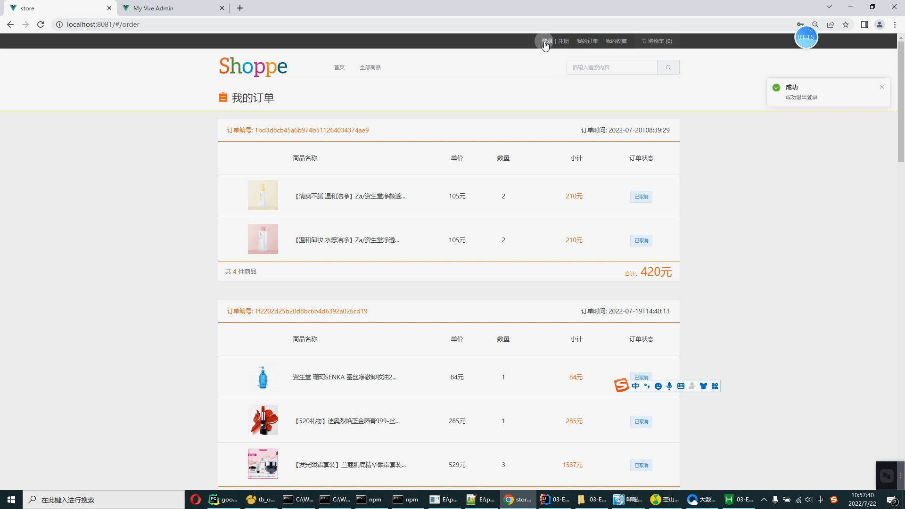

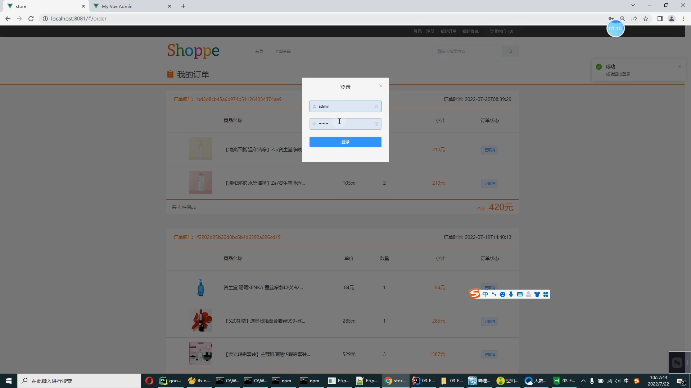

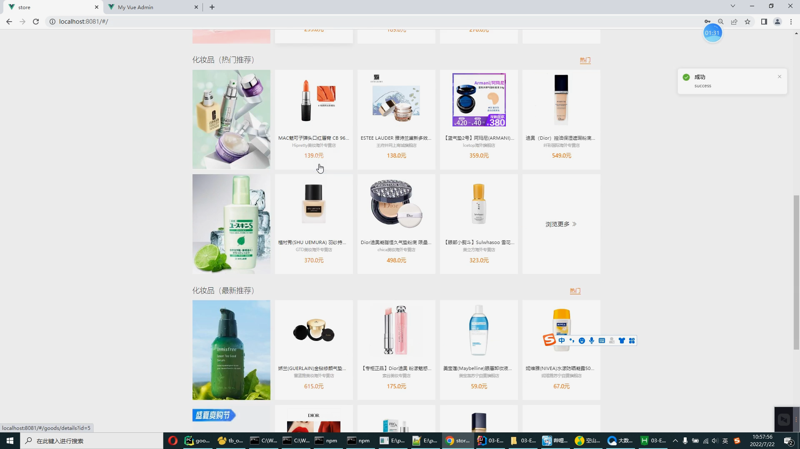

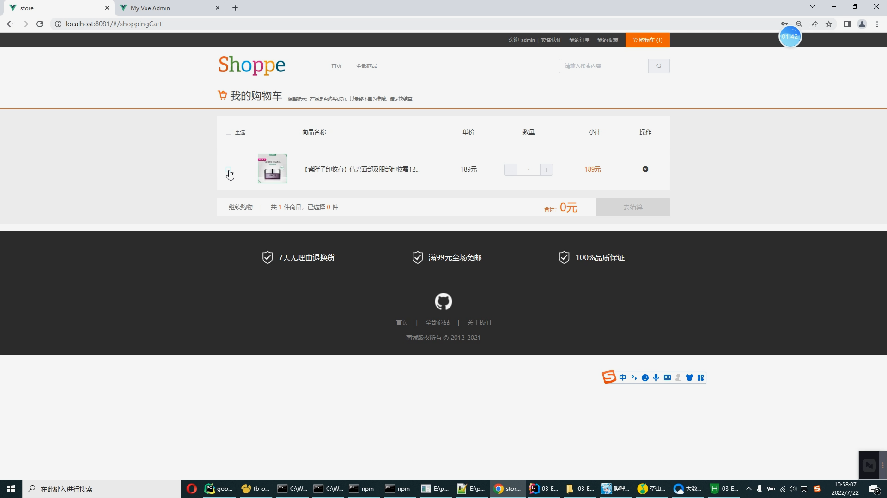

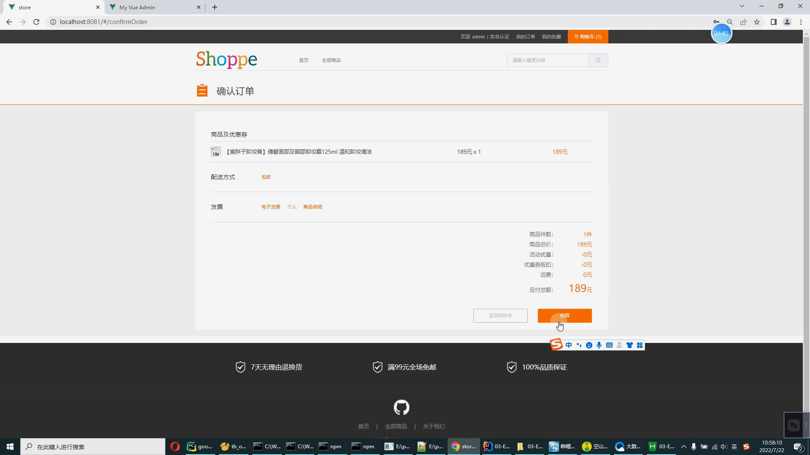

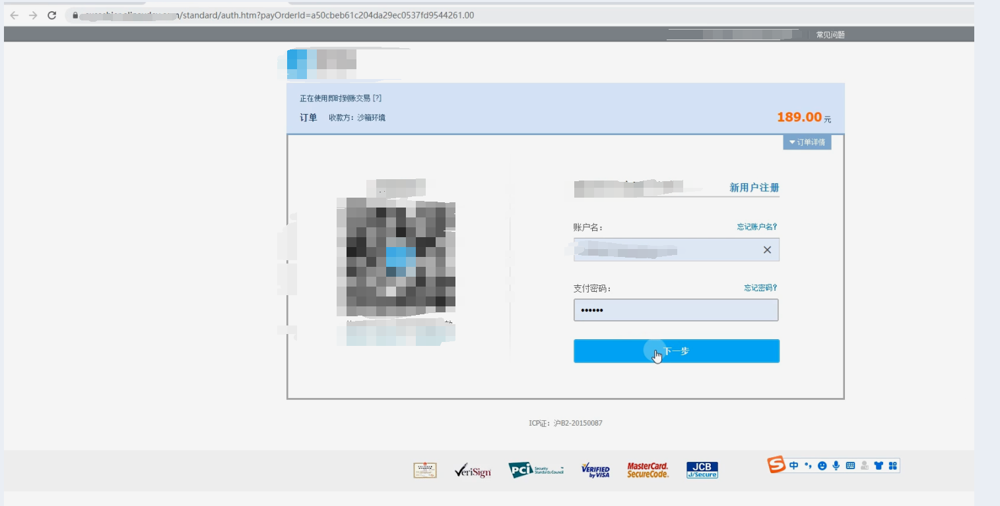

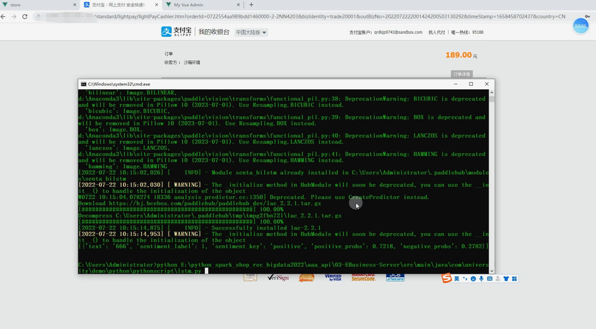

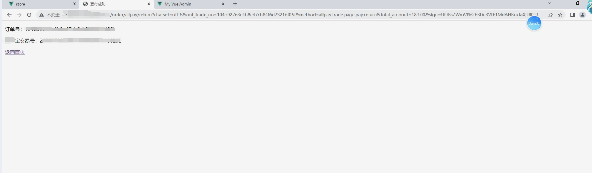

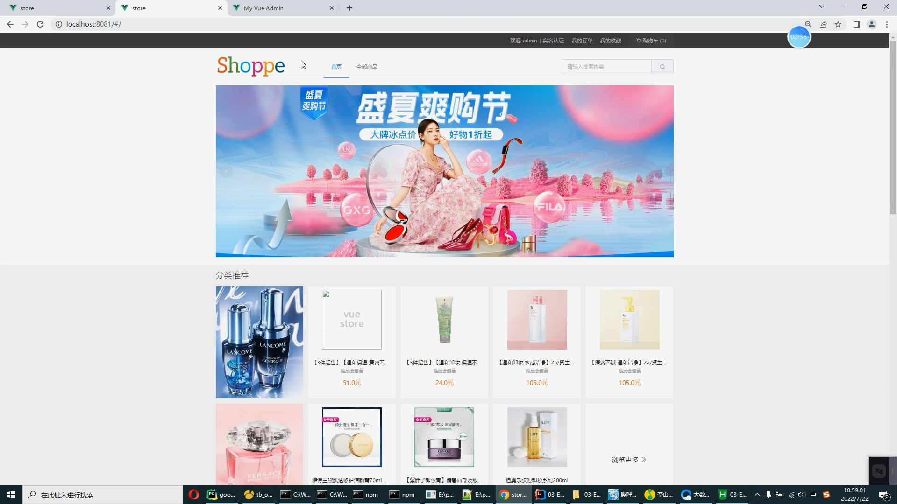

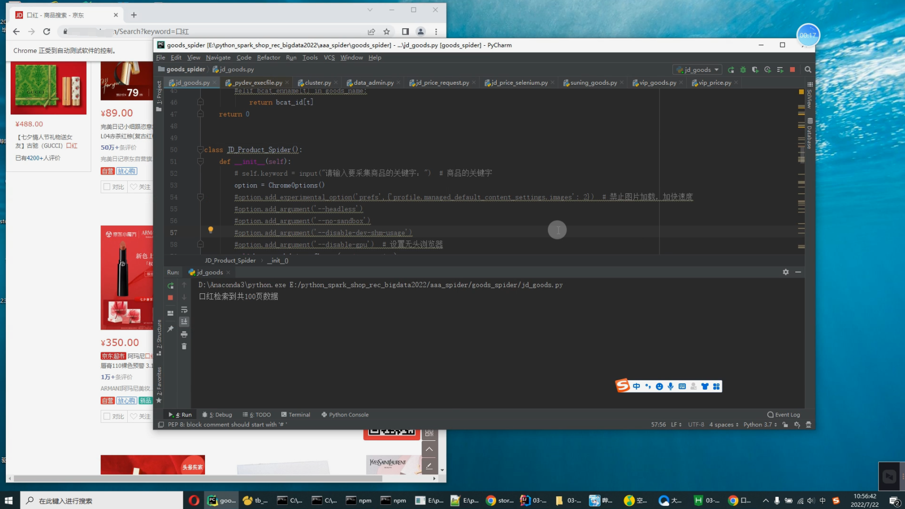

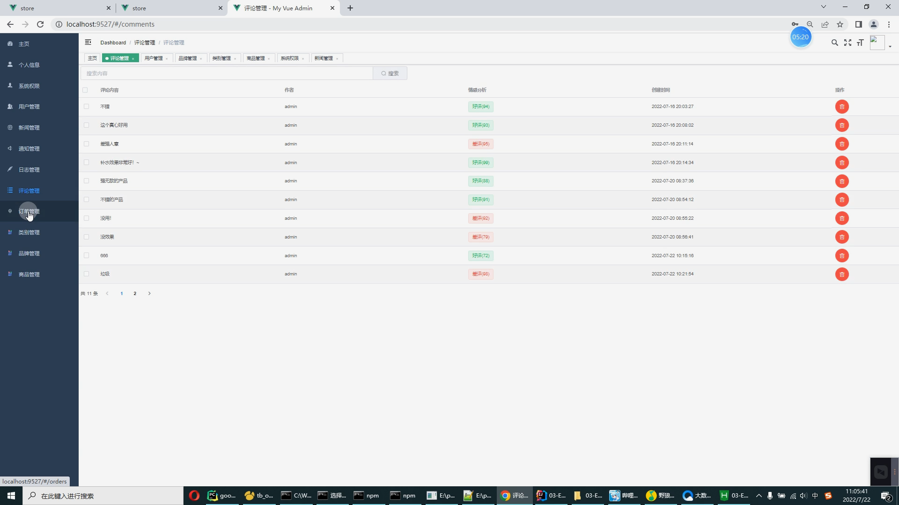

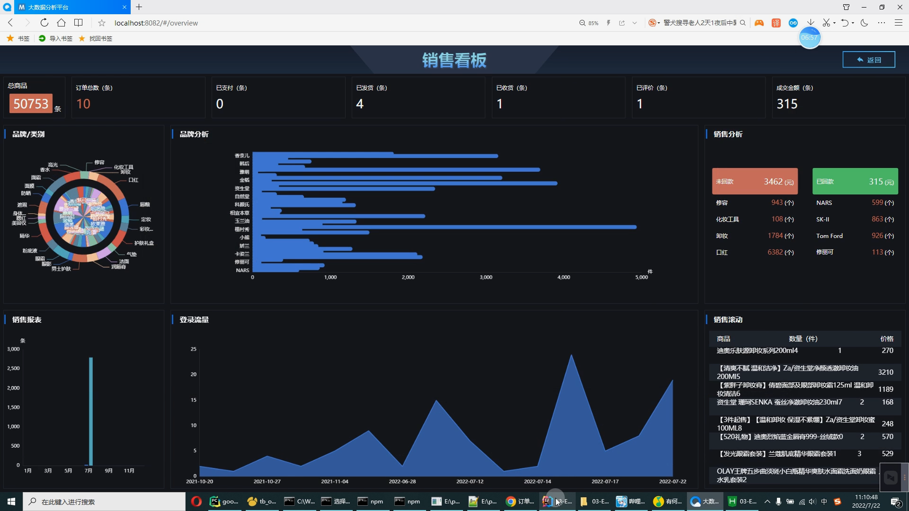

# 运行视频(B站)

https://www.bilibili.com/video/BV1yW4y1172B?spm_id_from=333.999.0.0

